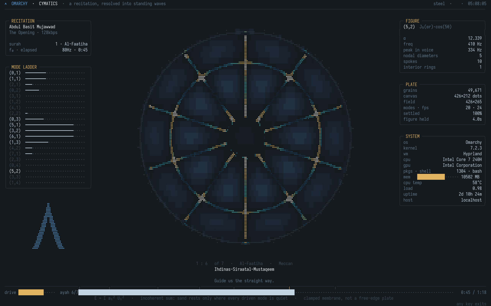
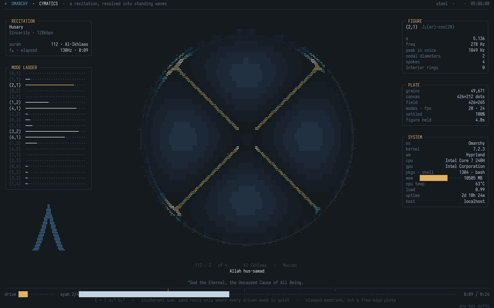
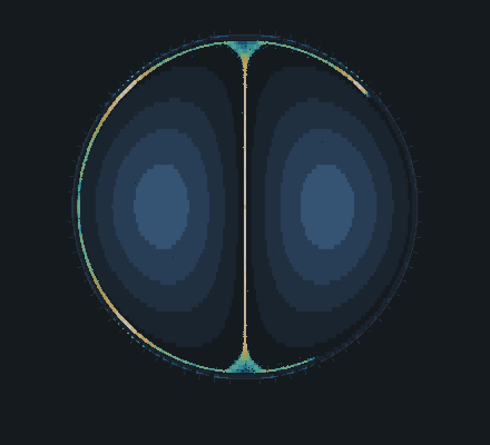

# chladni-tui

**A Chladni sand plate, simulated from first principles and drawn in your terminal — driven by the frequency content of real audio.**



Sand on a vibrating plate collects wherever the plate is still. This simulates
that — 50,000 grains on a clamped circular membrane, real Bessel eigenmodes — and
renders it in braille sub-dots, so one terminal cell becomes a 2×4 block of
pixels. Which figure appears is decided by analysing an actual recording.

No GPU, no graphics library, no image output. Escape sequences and arithmetic.

---

## The interesting part is the pipeline, not the simulator

Plenty of Chladni demos exist. The part with engineering in it is getting a
**physical simulation to follow real audio** and still look like anything.

The naive version does not work, and the reason is measurable. The
instantaneously loudest mode in these recordings changes about every **0.24
seconds**. Sand needs **seconds** to migrate across the plate. Drive the field
straight from the spectrum and the grains spend the entire time in transit — the
plate never forms a figure at all, it just looks like noise.

So the spectrum is integrated over ~2 s, a mode is committed to, held long
enough to actually settle, and cross-faded when the recording has clearly moved
on. And because the analysis is offline, the schedule does not have to be
*causal*: it is smoothed **forward and backward** so the decision is centred on
the moment rather than lagging it, then shifted **1.5 s early**, so a transition
begins before the audio does and the sand has stopped moving by the time you hear
why.

```
figure schedule: zero-phase smoothing, hysteresis, 1.5s lead
measured: every transition fires at -1.50s against the naive causal schedule
```

## Things that were wrong, and how they were found

Most of the work here was measurement, not cleverness.

**The palette never appeared.** Settled sand is bimodal — cells on a nodal line
held a median of 58 grains and up to 1055; every other cell held none. The linear
density→colour gain was **16× too hot**, pinning 816 cells on pure white with
almost nothing in between. No linear ramp covers two decades. It is now
logarithmic against a reference the picture measures on itself each frame, so it
stays correct at any grain count or terminal size.

**The plate read as empty.** `compose()` counted grain positions fresh every
frame, so a sub-dot went black the instant a grain left it — a settled figure was
only ever as bright as the grains standing on it at that exact instant. A decaying
accumulation buffer (~8 frames of memory) is what makes a nodal line read as a
stroke. It also made output *cheaper*: **0.71 → 0.12 MB/s** of escape sequences,
because smoother density means far fewer cells to repaint.

**Circles came out as ellipses.** A braille sub-dot is only square if the cell is
exactly 1:2. Iosevka is condensed — measured, its cell is about 1:2.7, making a
sub-dot 1.3× taller than wide. The real pixel geometry is read from the terminal
via `TIOCGWINSZ` instead of assumed.

**A third of the sand sat outside the plate.** Beyond the rim the field
saturates, so those grains took maximum random steps while the inward drift stayed
gentle; the two balanced and the sand parked there permanently. Re-seeding
escapees across the disc — rather than clamping them to the edge, which draws a
bright ring that is not a nodal line — took grains on the nodal set from **57% to
99%**.

**The centre filled with mush.** A mode with `m` nodal diameters goes as `rᵐ`, so
its *energy* goes as `r²ᵐ`. For (5,1) that is below 2% of peak out to 0.36 of the
radius — grains random-walk in and cannot get out. The dead zone is now measured
per mode (0.00 for (0,1), 0.36 for (5,1)); one fixed radius cannot be right for
all of them.

## The physics

A circular membrane clamped at its rim has eigenmodes

```
U_mn(r, θ) = J_m(α_mn · r) · cos(m·θ)
```

`α_mn` is the n-th positive zero of the Bessel function `J_m`. **m** gives nodal
*diameters* (so `2m` spokes), **n** gives `n−1` interior nodal *circles*.
Frequencies scale as `f_mn = f₀ · α_mn / α_01`.

Real audio excites several modes at once at **incommensurate** frequencies, so
the time-averaged agitation is the *incoherent* sum

```
E(x,y) = Σ aᵢ² · Uᵢ(x,y)²
```

not `(Σ aᵢUᵢ)²` — squaring a coherent sum invents interference nodes no real plate
has. This has a visible consequence: sand rests only where **every** active mode
is quiet, and the common zeros of several independent functions are *points*, not
curves. One clean mode traces lines; a chord beads into dots.

Each grain random-walks with a step proportional to `√E` and drifts down `∇E`, so
it stalls where `E ≈ 0` — the nodal set. The drift is clamped by **magnitude, not
per component**: clamping each axis separately lets a diagonal step run √2 longer
than a cardinal one, which parks grains in four bright blobs at the compass
points.

**Honest about the model:** a real metal Chladni plate has a *free* edge and obeys
the biharmonic plate equation; its modes are not Bessel functions. This is the
clamped-membrane model. And nothing about a particular recording produces these
shapes — a sustained tone at the same pitch gives the same figure. What sustained
recitation provides is a pitch stable long enough for sand to reach equilibrium.





## Library

```
chladni-add                                  # search, pick reciters, add
chladni-add add --surah 36 --reciter Husary_128kbps
chladni-add add --url <any link yt-dlp can reach>
```

114 surahs, 79 reciters. Search folds transliteration variants, so `rahman` finds
*Ar-Rahmaan*, `fatiha` finds *Al-Faatiha*, `the cow` finds *Al-Baqara*, `36` finds
*Yaseen* — doubled vowels and the assimilated definite article are normalised away.

Play order is not insertion order. Several recordings of the same surah back to
back is the same words several times, so tracks are grouped and the order always
takes from the largest group that is *not* the one just played — which avoids
adjacent repeats whenever it is possible at all (iff no surah holds more than
⌈n/2⌉ of the tracks). When it is not possible, it says so rather than pretending.

**No audio or scripture text is in this repository.** Recitations come from
[everyayah.com](https://everyayah.com); surah metadata and ayah text from
[alquran.cloud](https://alquran.cloud). Those are third-party works under their
own terms — translations in particular are often under active copyright. This
ships the client; you fetch the content.

## Install

```
git clone https://github.com/blurxy/chladni-tui && cd chladni-tui
./install.sh
chladni-add            # add something to play
chladni-screensaver    # run it
```

Python 3.11+, numpy, scipy; `ffmpeg`, `curl`, `fzf`; optionally `yt-dlp`, `gum`.
A Nerd Font with braille coverage — built against Iosevka.

Resizes live from a 60×16 terminal to fullscreen. Any key exits.
`--silent` for no audio, `--anonymise` to redact machine identifiers in screenshots.

`src/rasterize.py` draws the program's own escape-sequence output to a PNG using
the real font and cell metrics — which is how every screenshot here was taken,
without a screen.

## License

MIT. See [LICENSE](LICENSE).
